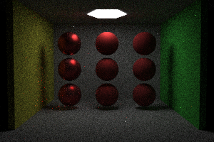

# 这是什么？

一个基于C/C++的光线追踪器。

跟着Ray Tracing In One Weekend以及南京大学《图形绘制技术》课程实现。

除了模型加载（tiny_obj_loader）与纹理加载（stb_image）外，未引用其他的库。

目前正在重构中。

# 效果展示

还未重构完，没时间去跑一张完整的图。。。

# 特性、TODO

- [x] BVH树加速光线求交
- [x] Path-Tracing
- [x] 多边形面光源
- [x] 蓝噪声生成与采样
- [x] Cook-Torrance风格的PBR材质
- [ ] 消除噪点（目前未知的BUG）
- [ ] 多线程加速
- [ ] 导入自定义三角面模型
